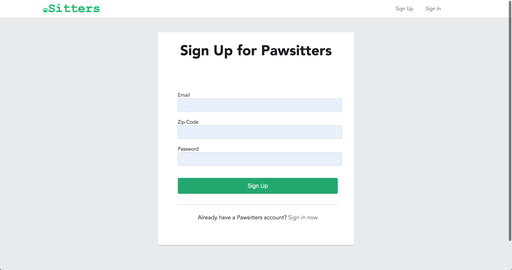
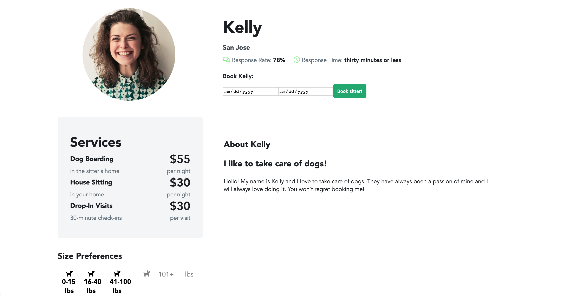

## Pawsitter

[Live Link](https://pawsittersisnotavailable.herokuapp.com/)

Welcome to Pawsitters! Pawsitters is a clone of Rover, a dog-sitting website. Many of the features found in this web-app are similar to the ones found in Rover. You're able to create an account, view all or just one sitter, as well as create, edit, or cancel a booking.

### Technologies used:
* Javascript
* Ruby on Rails
* PostgreSQL
* HTML
* SCSS/CSS
  
### Libraries used:
* React.js (including react-router-dom)
* Redux (including react-redux and redux-thunk middleware)
* jQuery (Ajax calls to my API)
* Bcrypt (user authorization)

### Features:
* Sign up with an email, zip, and password
* Sign in with your email and password
* Search for a sitter on the sitter index
* Viewing a sitters profile
* Booking a sitter
* Editing your bookings
  
  
