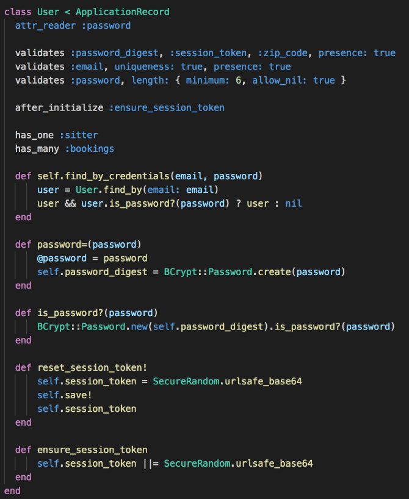

## PawSitters

### Technologies used:
* Ruby on Rails
* PostgreSQL
* HTML
* SCSS/CSS
  
### Libraries used:
* React.js (including react-router-dom)
* Redux (including react-redux and redux-thunk middleware)
* jQuery (Ajax calls to my API)
* Bcrypt (user authorization)

### Features:
* Sign up with an email, zip, and password
* Sign in with your email and password
* Search for a sitter on the sitter index
* Viewing a sitters profile
* Booking a sitter
* Editing your bookings

[Live Link](https://pawsittersisnotavailable.herokuapp.com/)

Welcome to PawSitters! PawSitters is a clone of Rover, a dog-sitting website. Many of the features found in this web-app are similar to the ones found in Rover. You're able to create an account, view all or just one sitter, as well as create, edit, or cancel a booking.

The main page above shows the PawSitters clickable logo as well as a Demo Login, Sign Up, and Sign In buttons. If currently logged in, the page will welcome the user and allow for them to logout, or view the sitter index or their bookings.

The sign up page features a similar page to Rover's sign up page. It asks a user to create an email, zip code, and password. Bcrypt is used to ensure user authorization. When logging in, all that is needed is the user's email and password.

The sitter show page shows all of the sitters information. It also has a booking button with dates on them to book a sitter whenever you want.

The booking index shows all of the bookings that a particular user has made. If they haven't made any bookings, they prompted to go make some. Users are also allowed to update and delete any of their bookings.

Implemented a user authentication pattern using BCrypt and Ruby on Rails for password hashing.

  
  
